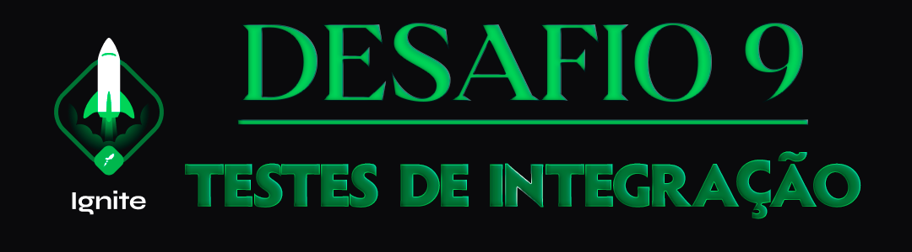

  

<h1 align="center"> RocketSeat 🚀 Ignite NodeJS 🌠</h1>

  
  
  
  

## 🧠 Detalhes do desafio

Nesse desafio, você deverá criar testes de integração para a mesma aplicação usada no [desafio anterior](https://www.notion.so/0321db2af07e4b48a85a1e4e360fcd11).

Você pode inclusive fazer as alterações no mesmo repositório submetido no desafio de testes unitários e submetê-lo na plataforma.

  

Feito com ❤️ por [Augusto Hermes](https://github.com/augustohermes) 👋.
